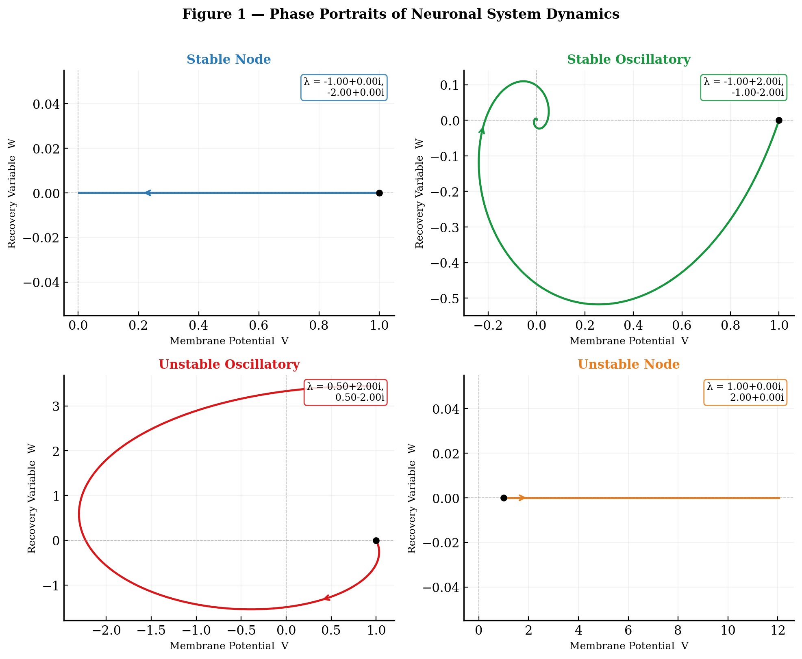
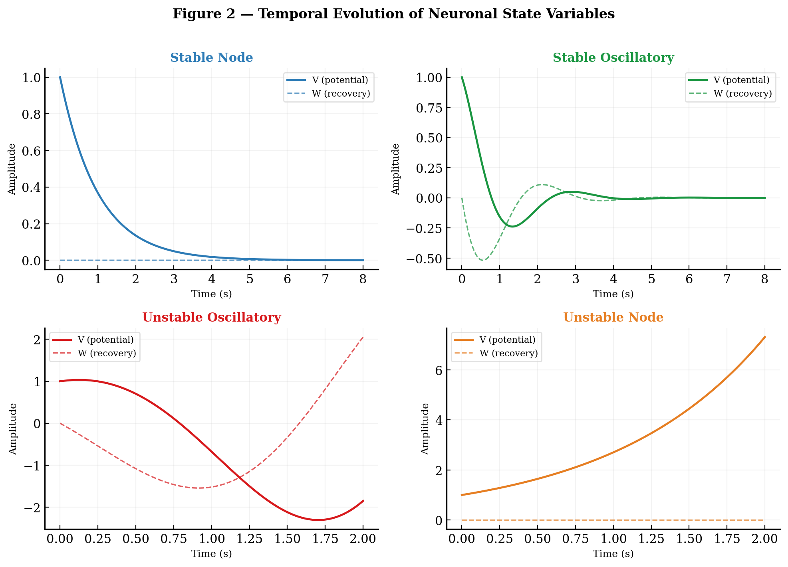
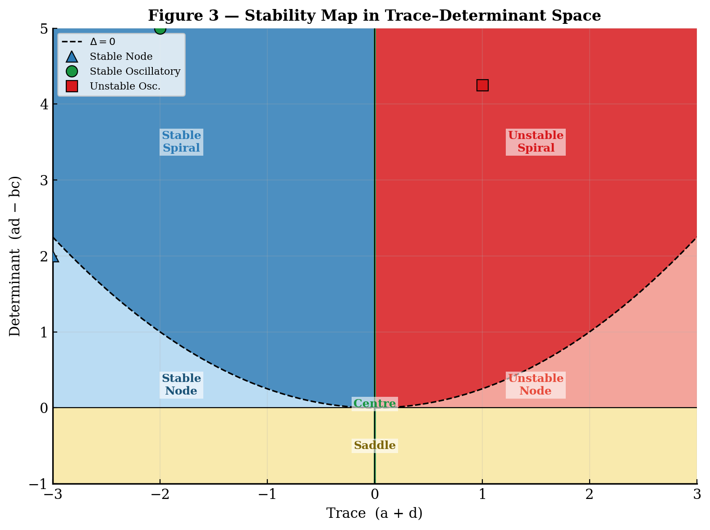
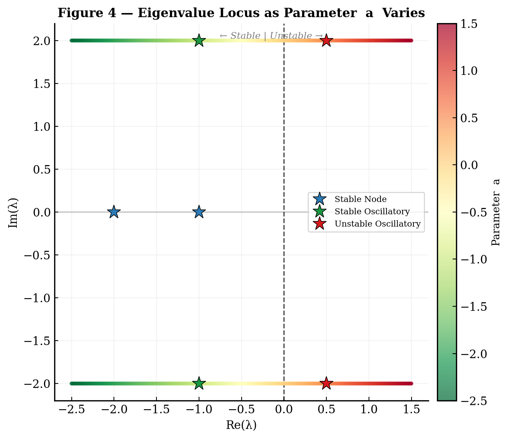

# Neuronal Stability Analysis

**Eigenvalue Analysis of Neuronal Firing Stability in a Two-Dimensional Linear Dynamical System**

*Kwakye Ishmael Affum · [@calyxish](https://github.com/calyxish) · kwakyeishmael07@gmail.com*

---

## Overview

This repository contains the full research code, figures, and paper accompanying the study:

> We investigate the stability of simplified neuronal dynamics through spectral analysis of two-dimensional linear dynamical systems `dX/dt = AX`, where X encodes membrane potential and a recovery variable. By systematically varying the system matrix A and computing its eigenvalues, we identify three qualitatively distinct behavioural regimes: stable decay, damped oscillation resembling biological firing patterns, and unstable divergence.

The work demonstrates how **eigenvalue structure** — specifically the trace and determinant of A — fully determines whether a neuron-like system is stable, oscillatory, or unstable.

---

## Repository Structure

```
neuronal-stability-analysis/
│
├── src/
│   └── simulation.py          # Core integration and stability routines
│
├── figures/                   # All generated figures (PNG)
│   ├── fig1_phase_portraits.png
│   ├── fig2_time_series.png
│   ├── fig3_stability_map.png
│   └── fig4_eigenvalue_locus.png
│
├── paper/
│   └── neuronal_stability_analysis.pdf   # Full research paper
│
├── analysis.py                # Reproduce all numerical results
├── generate_figures.py        # Generate all publication figures
├── build_paper.py             # Build the PDF from scratch
├── requirements.txt
└── README.md
```

---

## Key Results

| Configuration       | Eigenvalues          | Behaviour                  |
|---------------------|----------------------|----------------------------|
| Stable Node         | −1, −2               | Exponential decay to rest  |
| Stable Oscillatory  | −1 ± 2i              | Damped oscillation         |
| Unstable Oscillatory| +0.5 ± 2i            | Runaway spiral             |
| Unstable Node       | +1, +2               | Exponential divergence     |

The **stability boundaries** are defined analytically:

- **Stable** ⟺ Tr(A) < 0 and Det(A) > 0  
- **Oscillatory** ⟺ Tr(A)² < 4 Det(A)  
- **Unstable** ⟺ Tr(A) > 0 or Det(A) < 0  

---

## Figures

### Figure 1 — Phase Portraits
Four distinct trajectory types corresponding to the four parameter regimes.



### Figure 2 — Time Series
Temporal evolution of membrane potential V and recovery variable W.



### Figure 3 — Stability Map
A pixel-level classification of the trace–determinant parameter space, showing stable, oscillatory, saddle, and unstable regions.



### Figure 4 — Eigenvalue Locus
The eigenvalue pair traces a path across the complex plane as a diagonal parameter varies, crossing the imaginary axis at the stability bifurcation.



---

## Installation

```bash
git clone https://github.com/calyxish/neuronal-stability-analysis.git
cd neuronal-stability-analysis
pip install -r requirements.txt
```

---

## Usage

**Reproduce all numerical results:**
```bash
python analysis.py
```

**Regenerate all figures:**
```bash
python generate_figures.py
```

**Rebuild the PDF paper:**
```bash
python build_paper.py
```

---

## Dependencies

- `numpy >= 1.24`
- `matplotlib >= 3.7`
- `reportlab >= 4.0`

See `requirements.txt` for pinned versions.

---

## Mathematical Background

The model is based on the **Leaky Integrate-and-Fire (LIF)** neuron extended to two dimensions:

```
dV/dt = aV + bW
dW/dt = cV + dW
```

In matrix form: `dX/dt = AX`, with A ∈ ℝ²ˣ².

Eigenvalues are computed from the characteristic polynomial:

```
λ² − Tr(A)λ + Det(A) = 0
λ₁,₂ = [Tr(A) ± √(Tr(A)² − 4 Det(A))] / 2
```

The sign of the real parts determines stability; the imaginary parts set oscillation frequency.

---

## Paper

The full research paper is available at `paper/neuronal_stability_analysis.pdf`.

It includes:
- Introduction and biological motivation
- Full mathematical derivation
- Stability classification table
- All four figures with captions
- Discussion and limitations
- References

---

## Citation

If you find this work useful, please consider citing:

```bibtex
@misc{affum2025neuronal,
  author    = {Kwakye Ishmael Affum},
  title     = {Eigenvalue Analysis of Neuronal Firing Stability
               in a Two-Dimensional Linear Dynamical System},
  year      = {2025},
  publisher = {GitHub},
  url       = {https://github.com/calyxish/neuronal-stability-analysis}
}
```

---

## Author

**Kwakye Ishmael Affum**  
Computer Science And Mathematics
[github.com/calyxish](https://github.com/calyxish) · kwakyeishmael07@gmail.com

---

## License

MIT License. See `LICENSE` for details.
